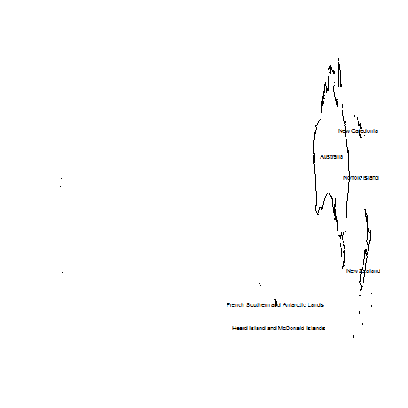
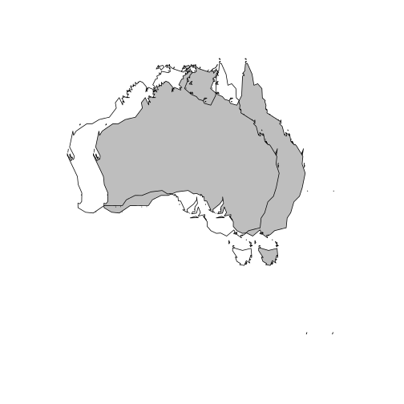
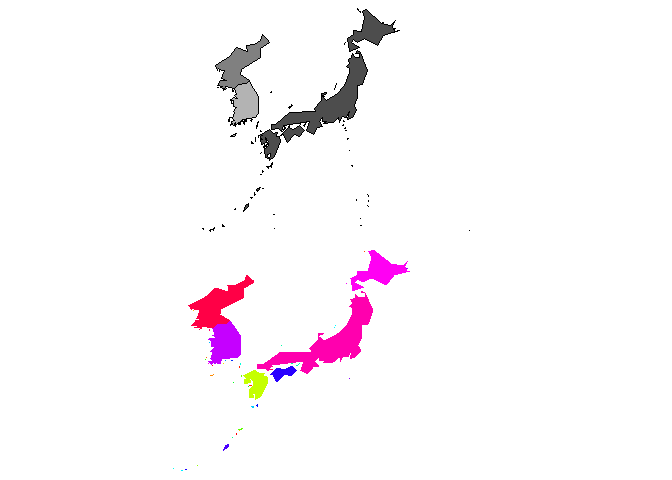
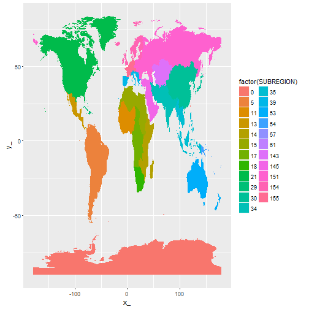
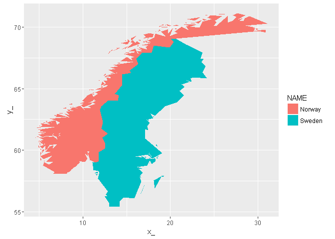

[](https://travis-ci.org/mdsumner/spbabel)

<!-- README.md is generated from README.Rmd. Please edit that file -->
Installation
------------

Spbabel can be installed directly from github:

``` r
devtools::install_github("mdsumner/spbabel")
```

spbabel: bisque or bouillon?
============================

Part of an effort towards dplyr/table-fication of Spatial classes and the spatial-zoo in R. Inspired by Eonfusion and Manifold and dplyr and Douglas Adams and spurned on by helpful twitter and ropensci discussions.

Spatial data in the `sp` package have a formal definition (extending class `Spatial`) that is modelled on shapefiles, and close at least in spirit to the [Simple Features definition](https://github.com/edzer/sfr). See [What is Spatial in R?](https://github.com/mdsumner/spbabel/wiki/What-is-Spatial-in-R) for more details.

Turning these data into tables has been likened to making fish soup, which has a nice nod to the universal translator [babelfish](https://en.wikipedia.org/wiki/List_of_races_and_species_in_The_Hitchhiker%27s_Guide_to_the_Galaxy#Babel_fish). Soup may be thick and creamy as in the "twice cooked" *bisque* or clear as in the "boiled" *bouillon* and this analogy can be applied in many ways including whatever way you like.

How does spbabel allow sp to work with dplyr?
=============================================

There are several ways to do this.

-   **1) dplyr-Spatial**: Write the dplyr verbs for the Spatial classes (runs into limits with sp not using actual data.frame.
-   **2) sptable**: Use the table of coordinates with identifiers for object and branch, like fortify, with sptable() and sptable()&lt;- workflow to fortify and modify in a more flexible way.
-   **3) geometry-column** Use a real data.frame but include the "Spatial\* objects as a list column. This is somewhat like the use of WKT or WKB geometry in tables, but without the need for constant (de)-serialization.
-   **4) single-level nesting**: Nest the fortify table for each object in a single column.
-   **5) double-level nesting**: Nest the twice-fortified table for each object, and then in the object table for each branch. This is close to full normalization, but cannot work with shared vertices or other topology.
-   **6) normalized-nesting**: Nest the normalized tables Vertices, Objects and the topological links between them.
-   **7) normalized**: A collection of related tables, without nesting.

The normalized approaches are in flux, though a non-nested approach is well fleshed out already in [gris](https://github.com/msdumnser/gris).

This document aims to illustrate each of these approaches, much is still work in progress.

What seems most promising?
--------------------------

-   1.  **dplyr-Spatial** is limited to the simple verbs that don't change the number of objects, pointedly `group_by` can only work on a an actual data frame. I think this is of novelty interest only.
-   1.  **sptable** provides a framework for transitioning between the Spatial classes and the ggplot2 fortify table of vertices, it's not that useful for routine use as you still juggle the two tables, but it's a useful tools for using inside other functions.
-   1.  **geometry-column** this is a non-starter, you end up needing to write special classes of data frames, which means you need methods for every operation. This shows the need for worker functions that can read geometry in a single value (i.e. WKB) from a database or source, and be able to expand that out. This is already provided by `wkb::readWKB` and wKT versions in rgeos. This approach (for reading) is illustrated in [manifoldr](https://github.com/msdumnser/manifoldr) and could be easily applied to other spatial DB. I think `sp_df` should be forked from this work as a dead-end.
-   4, 5) **single/double nesting** this is the way to go for a non-topological approach, but we need tools for dealing with the nesting/unnesting which means constructs like those in `gggeom` fleshed out fully. Not sure if we need classes, it can all be done generically and that might be best.
-   6, 7) **normalized tables** this approach takes us away from nesting but allows topology and a very general approach beyond 2D maps and "simple features" to object composed of primitives.

Why do this?
============

I want these things:

-   flexibility in the number and type/s of attribute stored as "coordinates", x, y, lon, lat, z, time, temperature, etc.
-   shared vertices
-   ability to store points, lines and areas together, sharing topology where appropriate
-   provide a flexible basis for conversion between other formats.
-   flexibility and ease of use
-   integration with database engines and other systems
-   integration with D3 via htmlwidgets, with shiny, and with gggeom ggvis or similar
-   data-flow with dplyr piping as the engine behind a D3 web interface

The ability to use [Manifold System](http://www.manifold.net/) seamlessly with R is a particular long-term goal, and this will be best done(TM) via dplyr "back-ending".

"But, I don't like pipes!"
--------------------------

Is nothing sacred?

Please note that the "pipelining" aspect of `dplyr` is not the main motivation here, and it's not even important. That is just a syntactic sugar, all of this work can be done in the standard function "chaining" way that is common in R. It's the generalization, speed, database-back-end-ability and need for flexibility in what Spatial provides that is key here.

1) Direct dplyr verbs for Spatial
=================================

Apply `dplyr` verbs to the attribute data of `sp` objects with dplyr verbs.

See `?dplyr-Spatial'` for supported verbs.

``` r
data(quakes)
library(sp)
coordinates(quakes) <- ~long+lat
library(spbabel)
## plot a subset of locations by number of stations
quakes %>% dplyr::filter(mag <5.5 & mag > 4.5) %>% select(stations) %>% spplot
```

<!-- -->

We can use polygons and lines objects as well.

``` r
library(maptools)
#> Checking rgeos availability: TRUE
data(wrld_simpl)
## put the centre-of-mass centroid on wrld_simpl as an attribute and filter/select
worldcorner <- wrld_simpl %>% 
  mutate(lon = coordinates(wrld_simpl)[,1], lat = coordinates(wrld_simpl)[,2]) %>% 
  filter(lat < -20, lon > 60) %>% 
  select(NAME)

## demonstrate that we have a faithful subset of the original object
plot(worldcorner, asp = "")
text(coordinates(worldcorner), label = worldcorner$NAME, cex = 0.6)
```

<!-- -->

``` r

worldcorner
#> class       : SpatialPolygonsDataFrame 
#> features    : 6 
#> extent      : -178.6131, 179.0769, -54.74973, -10.05167  (xmin, xmax, ymin, ymax)
#> coord. ref. :  +proj=longlat +ellps=WGS84 +datum=WGS84 +no_defs +towgs84=0,0,0 
#> variables   : 1
#> Source: local data frame [6 x 1]
#> 
#>                                  NAME
#>                                (fctr)
#> 1                           Australia
#> 2                       New Caledonia
#> 3                      Norfolk Island
#> 4 French Southern and Antarctic Lands
#> 5   Heard Island and McDonald Islands
#> 6                         New Zealand

## we can chain together standard operations as well as dplyr specific ones
wrld_simpl %>% as("SpatialLinesDataFrame") %>% summarise(big = max(AREA))
#> class       : SpatialLinesDataFrame 
#> features    : 1 
#> extent      : -180, 180, -90, 83.57027  (xmin, xmax, ymin, ymax)
#> coord. ref. : +proj=longlat +ellps=WGS84 +datum=WGS84 +no_defs +towgs84=0,0,0 
#> variables   : 1
#> Source: local data frame [1 x 1]
#> 
#>       big
#>     (int)
#> 1 1638094
```

The problem with this approach is that it is fundamentally limited by the fact that Spatial\*DataFrame objects are not actual data frames, they are very powerful but every feature that allows them to behave like data frames is painstakingly defined and extending this to the new features of extended data frames is onerous, and even slightly contentious.

This approach is limited to the simple verbs `arrange`, `distinct`, `filter`, `mutate`, `rename`, `select`, `slice`, `transmute`, and `summarize`. Summarize is a little bit of a stretch since it cannot be used after a `group_by` and so it is limited to collapsing to a single Spatial object, with all sub-geometries in one without any consideration of topology or relationships.

2) sptable: a round-trip-able extension to fortify
==================================================

The `sptable` function decomposes a Spatial object to a single table structured as a row for every coordinate in all the sub-geometries, including duplicated coordinates that close polygonal rings, close lines and shared vertices between objects.

Use the `sptable<-` replacement method to modify the underlying geometric attributes (here `x` and `y` is assumed no matter what coordinate system).

``` r
## standard dplyr on this S4 class
(oz <- filter(wrld_simpl, NAME == "Australia"))
#> class       : SpatialPolygonsDataFrame 
#> features    : 1 
#> extent      : 112.9511, 159.1019, -54.74973, -10.05167  (xmin, xmax, ymin, ymax)
#> coord. ref. :  +proj=longlat +ellps=WGS84 +datum=WGS84 +no_defs +towgs84=0,0,0 
#> variables   : 12
#> Source: local data frame [1 x 12]
#> 
#>     FIPS   ISO2   ISO3    UN      NAME   AREA  POP2005 REGION SUBREGION
#>   (fctr) (fctr) (fctr) (int)    (fctr)  (int)    (dbl)  (int)     (int)
#> 1     AS     AU    AUS    36 Australia 768230 20310208      9        53
#> Variables not shown: LON (dbl), LAT (dbl), rnames (chr)


## this is ready for ggplot2, though at the expense of needing the object attributes in a separate object
oztab <- sptable(oz)

##  make a copy to modify
woz <- oz
## modify the geometry on this object without separating the vertices from the objects
sptable(woz) <- sptable(woz) %>% mutate(x_ = x_ - 5)

# plot to compare 
plot(oz, col = "grey")
plot(woz, add = TRUE)
```

<!-- -->

We can also restructure objects, by mutating the value of object to be the same as "branch" we get individual objects from each.

``` r

pp <- sptable(wrld_simpl %>% filter(NAME == "Japan" | grepl("Korea", NAME)))
## explode (or "disaggregate"") objects to individual polygons
## here each branch becomes an object, and each object only has one branch
## (ignoring hole-vs-island status for now)
wone <- spFromTable(pp %>% mutate(object_ = branch_), crs = attr(pp, "crs"))
op <- par(mfrow = c(2, 1), mar = rep(0, 4))
plot(spFromTable(pp), col = grey(seq(0.3, 0.7, length = length(unique(pp$object)))))
plot(wone, col = sample(rainbow(nrow(wone), alpha = 0.6)), border = NA)
```

<!-- -->

``` r
par(op)
```

3) geometry-columns: store the Spatial\* thing in the column
============================================================

The "geometry-column" approach stores the complex object in a special column type, or *as some kind of an evaluation promise* to generate that special type from the underlying data structure. How this is actually done in other programs worth exploring, see [Geometry columns](https://github.com/mdsumner/spbabel/wiki/Geometry-columns) and [Round-trip sp and WKB](https://github.com/mdsumner/spbabel/wiki/Round-trip-Spatial-R---SQLite-with-WKB).

See [sp.df](https://github.com/mdsumner/sp.df) which is separated from this project because the methods required needs a lot of experimentation.

4) single-level nesting: tidyr fortify
======================================

Using `nest` will give us the analog of `fortify.Spatial*DataFrame` in the `Object_` column.

``` r
library(maptools)
data(wrld_simpl)
library(tidyr)
wnest <- nest(wrld_simpl)
 
(wtab <- wnest %>% select(Object_, SUBREGION) %>% unnest())
#> Source: local data frame [26,264 x 6]
#> 
#>    SUBREGION branch_ island_ order_         x_       y_
#>        (int)   (int)   (lgl)  (int)      (dbl)    (dbl)
#> 1         29       1   FALSE      1 -61.686668 17.02444
#> 2         29       1   FALSE      2 -61.887222 17.10527
#> 3         29       1   FALSE      3 -61.794449 17.16333
#> 4         29       1   FALSE      4 -61.686668 17.02444
#> 5         29       2   FALSE      1 -61.729172 17.60861
#> 6         29       2   FALSE      2 -61.853058 17.58305
#> 7         29       2   FALSE      3 -61.873062 17.70389
#> 8         29       2   FALSE      4 -61.729172 17.60861
#> 9         15       3   FALSE      1   2.963610 36.80222
#> 10        15       3   FALSE      2   4.785832 36.89472
#> ..       ...     ...     ...    ...        ...      ...

library(ggplot2)
ggplot(wtab) + aes(x = x_, y = y_, fill = factor(SUBREGION), group = branch_) + geom_polygon()
```

<!-- -->

5) double-level nesting: even tidier fortify
============================================

Unclear at the moment if this is worth doing at all. we can save space but it ends up like a recursive sp object anyway so we don't really gain anything. It's also difficult to see how to do the nesting in two natural parts, it's fine to double-nest in one go, but you can't single-nest and then nest again easily (it's easy to double-nest and then single-unnest though).

6) normalized-nesting: one table of non-analogous tables
========================================================

Create the bare-bones of gris, a single table with nested tables of Vertices, Branches and Objects.

``` r
wrld_simpl$NAME <- levels(wrld_simpl$NAME)[wrld_simpl$NAME]
(db <- db_df(wrld_simpl))
#> Source: local data frame [3 x 2]
#> 
#>     Name              Table
#>    (chr)              (chr)
#> 1 Vertex <tbl_df [26264,3]>
#> 2 Branch  <tbl_df [3768,3]>
#> 3 Object  <tbl_df [246,12]>
```

The nice part of this approach is that each individual table *within this db table* can be backed in a DB without modification, this is not true for nested tables.

There are shared vertices in this data set, so let's remove the duplication with a branch\_vertex table.

``` r
vertex <- db$Table$Vertex
vertex$vertex_ <- as.integer(factor(paste(vertex$x_, vertex$y_, sep = "|")))
db <- bind_rows(db, list(Name = "Branch_Vertex", Table = list(select_(vertex, "branch_", "vertex_"))))
db$Table[db$Name == "Vertex"] <- list(distinct_(vertex, "vertex_"))
names(db$Table) <- db$Name
```

We can multiply everything out again with joins, though I haven't figured out how this should all work - would it make sense to set up a "cascaded join" for the object or something like that . . .

``` r
library(ggvis)
#> 
#> Attaching package: 'ggvis'
#> The following object is masked from 'package:ggplot2':
#> 
#>     resolution
Objects <- function(x) x$Table$Object
Branches <- function(x) x$Table$Branch
Vertices <- function(x) x$Table$Vertex


tab <- Objects(db)  %>% 
  dplyr::select_("object_", "NAME") %>% 
  filter(NAME %in% c("Norway", "Sweden")) %>% 
   inner_join(Branches(db)) %>% inner_join(db$Table$Branch_Vertex) %>% inner_join(Vertices(db)) %>% group_by(branch_) 
#> Joining by: "object_"
#> Joining by: "branch_"
#> Joining by: c("branch_", "vertex_")
#p <- tab %>%   ggvis(~x_, ~y_, fill= ~NAME) %>%  layer_paths() 
#print(p)
 ggplot(tab)  + aes(x_, y_, group = branch_, fill = NAME) + geom_polygon()
```

<!-- -->

``` r
obj <- Objects(db)  %>% 
  dplyr::select_("object_", "NAME") %>% 
  filter(NAME %in% c("Norway", "Sweden"))
```

7) normalized: gris
===================

gris is pretty much what we've recreated in 6, but including methods to convert to rgl and triangulate and plot.

Issues
======

-   need semantics for one-to-many and many-to-one copy rules, i.e. exploding an object copies? all attributes to the new objects or perhaps applies a proportional rule: see Transfer Rules in Manifold
-   some details are carried by attr()ibutes on the objects, like "crs": these don't survive the journey through functions without using classes - ultimately a branched object should carry this information with it

Thanks to @holstius for prompting a relook under the hood of dplyr for where this should go: <https://gist.github.com/holstius/58818dc9bbb88968ec0b>

This package `spbabel` and these packages should be subsumed partly in the overall scheme:

<https://github.com/mdsumner/dplyrodbc> <https://github.com/mdsumner/manifoldr>
