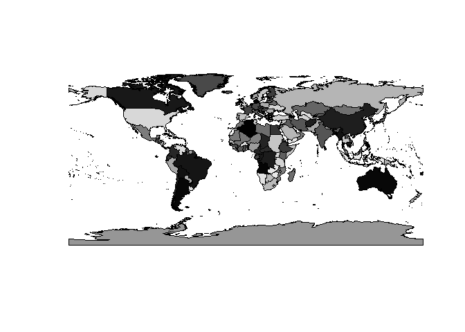

<!-- README.md is generated from README.Rmd. Please edit that file -->
spbabel
-------

Part of an effort towards dplyr/table-fication of Spatial classes and the spatial-zoo in R. Inspired by Eonfusion and Manifold and spurned on by helpful ropensci discussions.

Installation
------------

Spbabel can be installed directly from github:

``` r
devtools::install_github("mdsumner/spbabel")
```

Experimental
------------

Recent discussion resulted in a "nested data frame" approach, I've applied that in `nested.r` with two-levels of nesting, Objects as the table to store each Branch (part or piece or ring or linestring), and each Branch table stores actual vertices (x, y).

This example shows raw round-tripping, just to prove it mostly works.

``` r
library(spbabel)
#> Loading required package: sp
library(maptools)
#> Checking rgeos availability: TRUE
data(wrld_simpl)
xa <- as_nested_df(wrld_simpl)
## method for plotting this nsp_df (nested sp df) shows round-trip back to Spatial
plot(xa, col = grey(seq(0, 1, length = 246)))
```

<!-- -->

Have a closer look at what happens, we need to keep at least `Object`, and we copy out `ISO3` to all vertices. This is essentially an implicit join, made simpler since rows store data frames 'recursively'.

``` r
library(dplyr)
library(tidyr)

## Be careful to keep the nested Object table - here see all vertices
xa %>% select(Object, ISO3) %>% unnest() %>% unnest()
#> Source: local data frame [26,264 x 6]
#> 
#>      ISO3  cump  part  hole          x        y
#>    (fctr) (dbl) (dbl) (dbl)      (dbl)    (dbl)
#> 1     ATG     1     1     0 -61.686668 17.02444
#> 2     ATG     1     1     0 -61.887222 17.10527
#> 3     ATG     1     1     0 -61.794449 17.16333
#> 4     ATG     1     1     0 -61.686668 17.02444
#> 5     ATG     2     2     0 -61.729172 17.60861
#> 6     ATG     2     2     0 -61.853058 17.58305
#> 7     ATG     2     2     0 -61.873062 17.70389
#> 8     ATG     2     2     0 -61.729172 17.60861
#> 9     DZA     3     1     0   2.963610 36.80222
#> 10    DZA     3     1     0   4.785832 36.89472
#> ..    ...   ...   ...   ...        ...      ...
```

Questions: how do we protect special columns, like "Object" - and how do we ensure they are recorded when unnested? Same goes for PROJ.4 string, here I use an attribute.

I also tried store list of Polygons() in the column, that's kind of simple but you need S3 methods for everything - this is is `sp-df.r`.

Nested data frames are much easier, I find it more natural to use two-level nesting, but you could go further to store more information on individual pieces, their area, winding, etc. You could also just store the fortify-table at one level nesting, more to experiment with.

*Still, nesting cannot provide deduplication of vertices - so I still need the "outer" view that gris provides.*

Usage
-----

Apply pipeline modifications to the attribute data of `sp` objects with dplyr verbs.

``` r
data(quakes)
library(sp)
coordinates(quakes) <- ~long+lat
library(spbabel)
## plot a subset of locations by number of stations
quakes %>% dplyr::filter(mag <5.5 & mag > 4.5) %>% select(stations) %>% spplot
```

<!-- -->

We can use polygons and lines objects as well.

``` r
library(maptools)
data(wrld_simpl)

x <- wrld_simpl %>% mutate(lon = coordinates(wrld_simpl)[,1], lat = coordinates(wrld_simpl)[,2]) %>% filter(lat < -20, lon > 60) %>% select(NAME)
plot(x, asp = ""); text(coordinates(x), label = x$NAME, cex = 0.6)
```

<!-- -->

use the `sptable<-` replacment method to modify the underlying geometric attributes (here `x` and `y` is assumed no matter what coordinate system).

``` r
## standard dplyr on this S4 class
w2 <- filter(wrld_simpl, NAME == "Australia")
plot(w2, col = "grey")

## modify the geometry on this object
sptable(w2) <- sptable(w2) %>% mutate(x = x - 5)

plot(w2, add = TRUE)
```

<!-- -->

TODO
----

Create idioms for modifying the geometry with dplyr verbs and/or piping.

Consider whether `summarise` is a sensible for Spatial.

Can we do geometry manipulations like `sptable(w2) <- sptable(w2) %>% mutate(object = part, part = 1)` and sensibly restore the attributes on the way? Just copy the value outs?

Implement `sample_n` and `sample_frac`.

Implement the joins.

Approach
--------

Create methods for the dplyr verbs: filter, mutate, arrange, select etc.

This is part of an overall effort to normalize Spatial data in R, to create a system that can be stored in a database.

Functions `sptable` and `spFromTable` create `tbl_df`s from Spatial classes and round trip them. This is modelled on `raster::geom rather` than `ggplot2::fortify`, but perhaps only since I use raster constantly and ggplot2 barely ever.

Complicating factors are the rownames of sp and the requirement for them both on object IDs and data.frame rownames, and the sense in normalizing the geometry to the table of coordinates without copying attributes.

(See `mdsumner/gris` for normalizing further to unique vertices and storing parts and objects and vertices on different tables. Ultimately this should all be integrated into one consistent approach.)

Thanks to @holstius for prompting a relook under the hood of dplyr for where this should go: <https://gist.github.com/holstius/58818dc9bbb88968ec0b>

This package `spbabel` and these packages should be subsumed partly in the overall scheme:

<https://github.com/mdsumner/dplyrodbc> <https://github.com/mdsumner/manifoldr>
